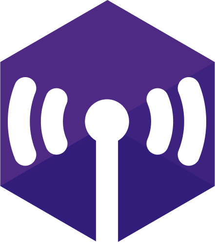

  

   

  

# wircom (daq-wireless-com)

**wircom** (daq-wireless-com) is an application-layer protocol for wireless data acquisition in Northwestern Formula Racing's (NFR) telemetry system. It is designed to be fast, efficient, and reliable, and is intended to run in resource-limited environments, such as microcontrollers.